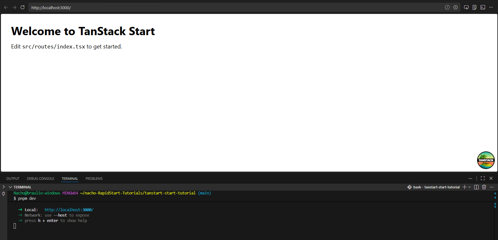
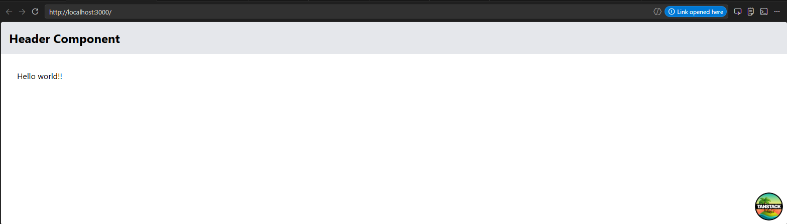
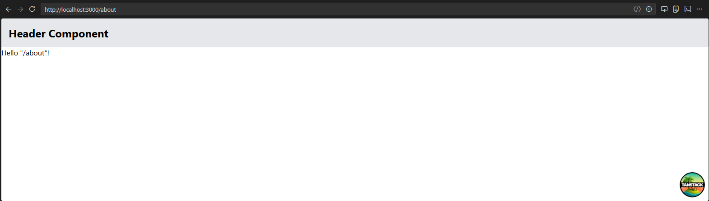
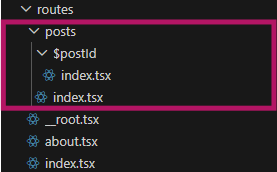
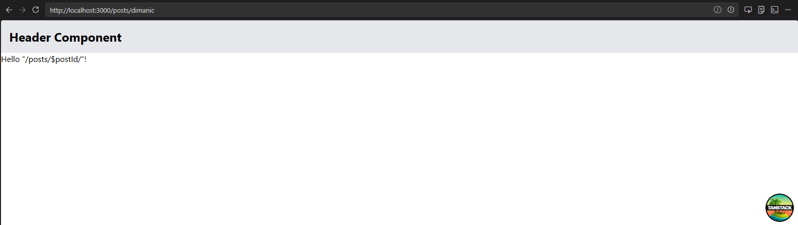

# Creating a Fast Start STACK Tutorial
## FastStart STACK Tutorial

This command will prompt you to select a template. Choose the "STACK" template to create a new project with the Fast Start STACK configuration.

```bash
pnpm create @tanstack/start@latest
```

```bash
cd your-project-name
```

What I've created:
```text
Project:         tanstart-start-tutorial
│    Location:        C:\Users\Nacho\nacho-RapidStart-Tutorials\tanstart-start-tutorial
│    Framework:       React
│    Mode:            file-router
│    Package manager: pnpm
│  
│    ORM:             Prisma
│    Deploy:          Nitro (agnostic)
│    Other add-ons:   ESLint
│  
│    Initialize git:  yes
│    Install deps:    yes
│    Agent skills:    no
```

Then you need to approve the scripts of the packages to run the build process.

```bash
pnpm approve-builds
```

Now you can install dependencies and start the development server:

```bash
pnpm i
pnpm dev
```

It will give you a URL `http://localhost:3000`, but if you are not lucky you will encounter an error (bug) if you try to open it. Because nightly Nitro + Vite SSR = sometimes unstable.

If you encounter an **error**, you can try the following steps:

```bash
pnpm approve-builds
# It's better to remove it manually on the file explorer system (less time consuming) but you can also do it with the command line:
$ rm -rf node_modules pnpm-lock.yaml
pnpm install
pnpm dev
```




Now we can create the `tanstart-start-tutorial\src\common\components\Header.tsx`, a simple Header component:

```tsx
export default function Header() {
  return (
    <header className="p-4 bg-gray-200">
      <h1 className="text-2xl font-bold">Header Component</h1>
    </header>
  )
}
```

And put it in the `tanstart-start-tutorial\src\routes\__root.tsx`:

```tsx
import { HeadContent, Scripts, createRootRoute } from '@tanstack/react-router'
import { TanStackRouterDevtoolsPanel } from '@tanstack/react-router-devtools'
import { TanStackDevtools } from '@tanstack/react-devtools'

import appCss from '../styles.css?url'
import Header from '#/common/components/Header'

export const Route = createRootRoute({
  head: () => ({
    meta: [
      {
        charSet: 'utf-8',
      },
      {
        name: 'viewport',
        content: 'width=device-width, initial-scale=1',
      },
      {
        title: 'TanStack Start Starter',
      },
    ],
    links: [
      {
        rel: 'stylesheet',
        href: appCss,
      },
    ],
  }),
  shellComponent: RootDocument,
})

function RootDocument({ children }: { children: React.ReactNode }) {
  return (
    <html lang="en">
      <head>
        <HeadContent />
      </head>
      <body>
        <Header />
        {children}
        <TanStackDevtools
          config={{
            position: 'bottom-right',
          }}
          plugins={[
            {
              name: 'Tanstack Router',
              render: <TanStackRouterDevtoolsPanel />,
            },
          ]}
        />
        <Scripts />
      </body>
    </html>
  )
}
```

Now change the info on the index page:

```tsx
import { createFileRoute } from '@tanstack/react-router'

export const Route = createFileRoute('/')({ component: Home })

function Home() {
  return (
    <div className="p-8">
      <h1>Hello world!!</h1>
    </div>
  )
}
```

Then you can see the changes in the browser:




## Now let's add a new page to the project:

Create a new file `tanstart-start-tutorial\src\routes\about.tsx`:

### And it will automatically add you the code for the route.

You only have to do a `pnpm dev` and you will see the new page in the browser:



## Nonetheless, the users don't navigate normally with the URL, so we need to add a link to the about

So I put a link on both the home and about pages to navigate between them:

```tsx
import { createFileRoute, Link } from '@tanstack/react-router'

export const Route = createFileRoute('/')({ component: Home })

function Home() {
  return (
    <div className="p-8">
      <h1>Hello world!!</h1>  
      <Link to='/about'>Go to About page!!!</Link>
    </div>
  )
}
```

```tsx
import { createFileRoute, Link } from '@tanstack/react-router'

export const Route = createFileRoute('/about')({
  component: RouteComponent,
})

function RouteComponent() {
  return (
    <>
      <div>Hello "/about"!</div>
      <Link to="/">Go to home page!!!</Link>
    </>
  )
}
```

## Dynamic routing

Let's now create a post page with a dynamic route `tanstart-start-tutorial\src\routes\posts\$postId.tsx`:

You need to create first the post directory and then the file `index.tsx` inside it.

And then to do the dynamic routing you have to create a folder with the name of the parameter with a `$` at the beginning and then create the `index.tsx` file inside it.



And that's how you can create a dynamic route on TanStack Start.



## And that's all for this fast start tutorial :)